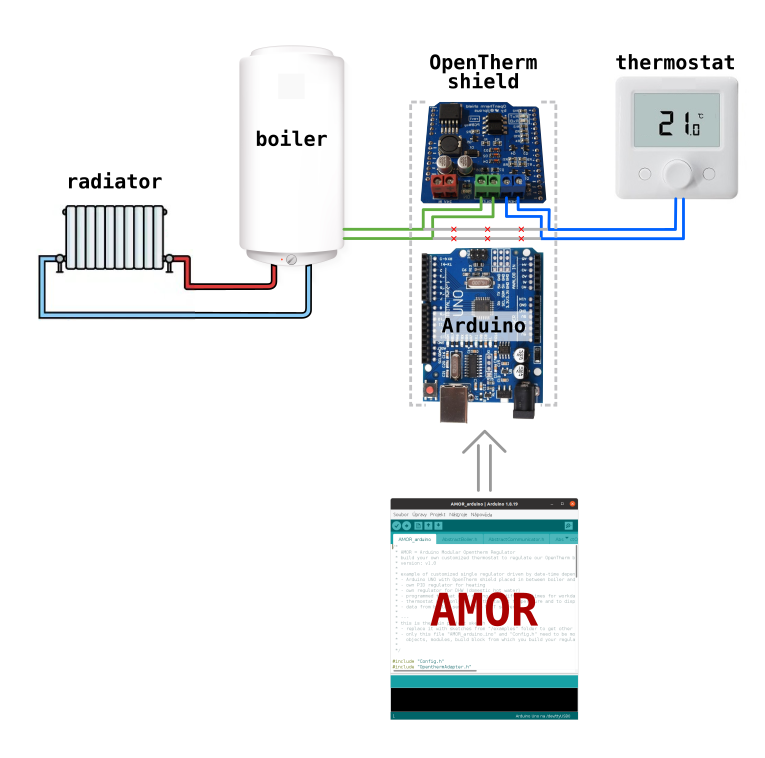
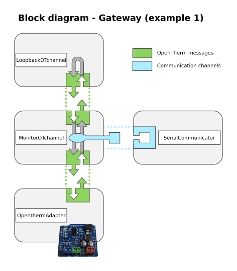

# Example 1 - Gateway
This example shows the most simple usage of AMOR. It acts as a simple man-in-the-middle between boiler and thermostat. It does not modify the OpenTherm messages sent from the thermostat to the boiler and back. It only prints these messages to the serial port, you can display them for eample in the *Serial Port Monitor* of *Arduino IDE*

# Hardware configuration
For this example to work, it is necessary only to disconnect the wires from the boiler to the thermostat and place the OpenTherm Shield in between as shown on following picture:

# Block diagram
Next diagram shows, how the blocks (= AMOR modules) are connected together in this example:

# How to make it work
In order to make this example run, just do this:
* copy the contents of this example and paste it in the main project file "AMOR_arduino.ino" (replace everything there)
* check the "Config.h", if the pin numbers for OpenTherm shield are correct, eventually change the language
* compile and upload to the arduino

