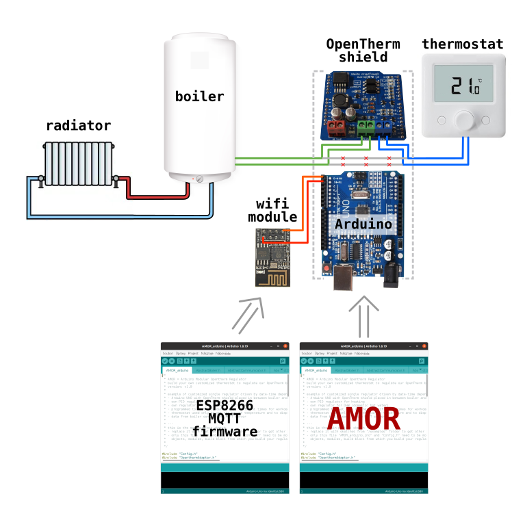

# Example 2 - MQTT Gateway
In this example AMOR acts again as a man-in-the-middle between boiler and thermostat, the same as in Example #1. It does not modify the OpenTherm messages sent from the thermostat to the boiler and back. It forwards these messages via serial port to the ESP8266 wifi module, which sends them to the MQTT server. Focus of this example is the establishement of the wifi/MQTT toolchain. The AMOR code remains almost identic as in Example #1, the difference is only in one single line.

# Hardware configuration
In this example we will need ESP8266 wifi module connected to the serial port of Arduino UNO:

# Block diagram
Next diagram shows, how the blocks (= AMOR modules) are connected together in this example:

# How to make it work

## Prepare the ESP8266 wifi module
* prepare the MQTT server
  * either install your own local MQTT server like [Mosquitto](https://mosquitto.org/download/) on [Raspberry PI](https://en.wikipedia.org/wiki/Raspberry_Pi)
  * or use any web/cloud MQTT service, such as [HiveMQ Cloud](https://www.hivemq.com/mqtt-cloud-broker/). Or you can choose any other, see for example a [list of MQTT brokers at mntolia.com](https://mntolia.com/10-free-public-private-mqtt-brokers-for-testing-prototyping/)
* configure the "esp8266_mqtt_firmware" - in configuration section insert your wifi login info and info of the used MQTT server
* upload the "esp8266_mqtt_firmware" to the ESP8266 wifi module
## Prepare the Arduino
* copy the contents of this example and paste it in the main project file "AMOR_arduino.ino" (replace everything there)
* check the "Config.h", generally settings from Example #1 should work; for this example there are only few new config options related to the MQTT communication, from which the only really important is "MQTT_BASE_TOPIC"
* compile and upload to the arduino

