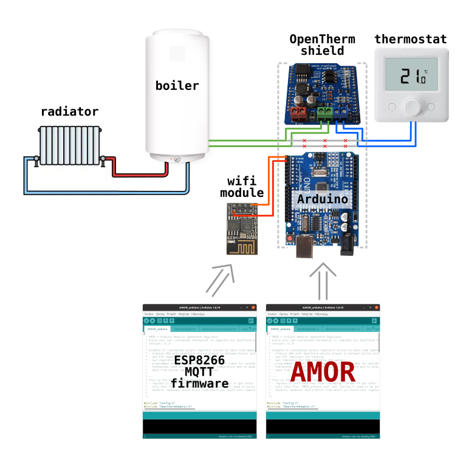
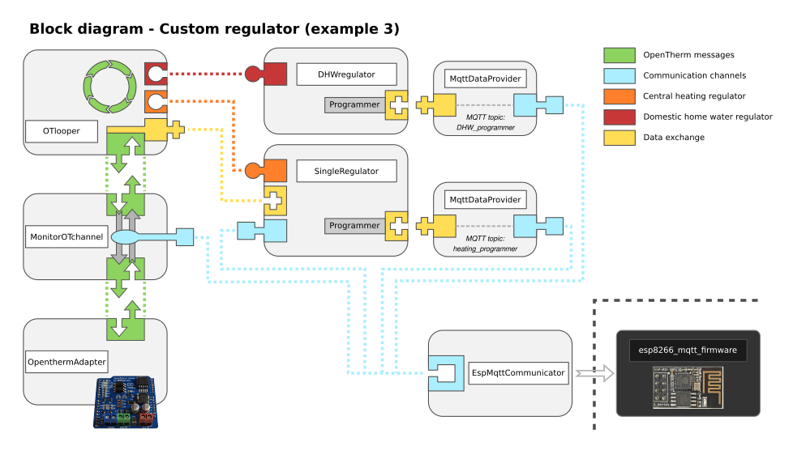

# Example 3 - Thermostat
In this example AMOR is an autonomous thermostat. It actively regulates the heating water temperature (using PID regulator) and commands the boiler. Also it regulates the temperature of DWH (Domestic Home Water). It receives the room temperature and setpoint temperature from the room thermostat, which besides that serves only as a displaying unit. The boiler parameters are sent to the ESP8266 wifi module, which forwards them to the MQTT server. You can also change the programms via MQTT.

# Hardware configuration
Hardware configuration in example #3 is identic to example #2:

# Block diagram
Next diagram shows, how the blocks (= AMOR modules) are connected together in this example:

# How to make it work

## Prepare the ESP8266 wifi module
You can keep the ESP8266 the same as in the example #2.
## Prepare the Arduino
* copy the contents of this example and paste it in the main project file "AMOR_arduino.ino" (replace everything there)
* check the "Config.h", keep settings from Example #2. Default values for other config options should work fine for the first try. Else you are free to modify them, there are verbose comments in the config file that will guide you.
* compile and upload to the arduino

# How to use it - modifying the heating programs
After you successfully make it work, you will see the MQTT topics filling with data, what the thermostat is currently doing. You preset the default programs in your sketch, but you can change them using MQTT messages. If you publish the message into the topic "heating_programmer", you can change the programs used for heating. The same for domestic home water (DHW), when you publish message to the topic "DHW_programmer".

## Programming string format
The format of messages is currently a little bit stupid string of 8 numbers separated by columns. Explication is following:
   * number #1 - number of programm - each programmer can have 5 independent programms (numbered 0-4) by default. Can be modified in config.h by changing the option PROGRAMS_COUNT.
   * number #2 - program type:
		* 0 = OFF - If active, the boiler is switched off. Number #3 is ignored with this program.
		* 1 = fixed temperature of heating water, the boiler will heat the heating water to temperatere given by number #3
		* 2 = PID regulator - boiler will regulate the heating so that the room temperature reaches and keeps the temperature given by number #3
		* 3 = PID regulator - the setpoint temperature is taken dynamically from the room thermostat. Number #3 is ignored with this program.
		* +128 = temporary program - if you add 128 to your program, this will be deleted after it finishes. Using this you can for example heat up the radiator temporarily for one hour. eg. 129 = temporary fixed temperature; 130 = temporary PID regulator
   * number #3 - target temperature, setpoint, different for different program types, see number #2                 
   * number #4 - day
		* 1 = Sunday, 2 = Monday, 4 = Tuesday, 8 = Wednesday, 16 = Thursday, 32 = Friday, 64 = Saturday
		* you can combine them - 65 = 1+64 = weekend (Sunday + Saturday); 62 (32 + 16 + 8 + 4 + 2) = all working days
   * number #5 + #6 - hour and minute to start the program      
   * number #7 + #8 - hour and minute to stop the program

### Example
send text `0,130,22,4,6,0,18,30` to the MQTT topic "heating_programmer"

which means - modify program 0, set it to PID regulator, it is temporary program (after passing, switch it off to never repeat), heat to room temperature 22˚C, on Tuesday from 6:00 (6 am) to 18:30 (6:30 pm)
