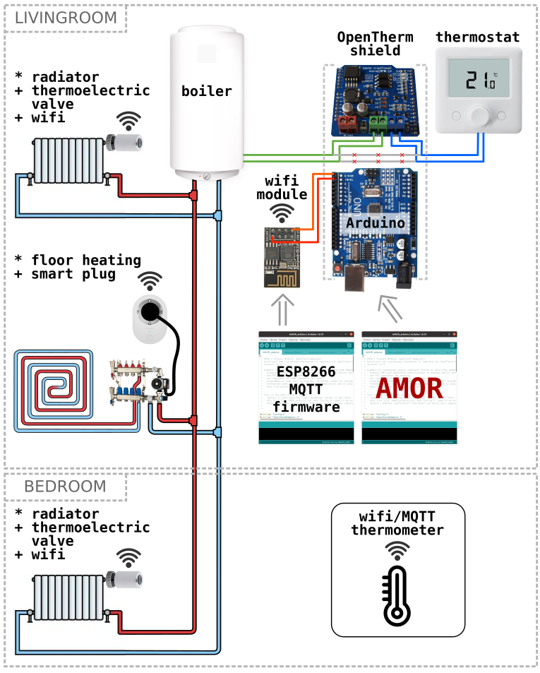
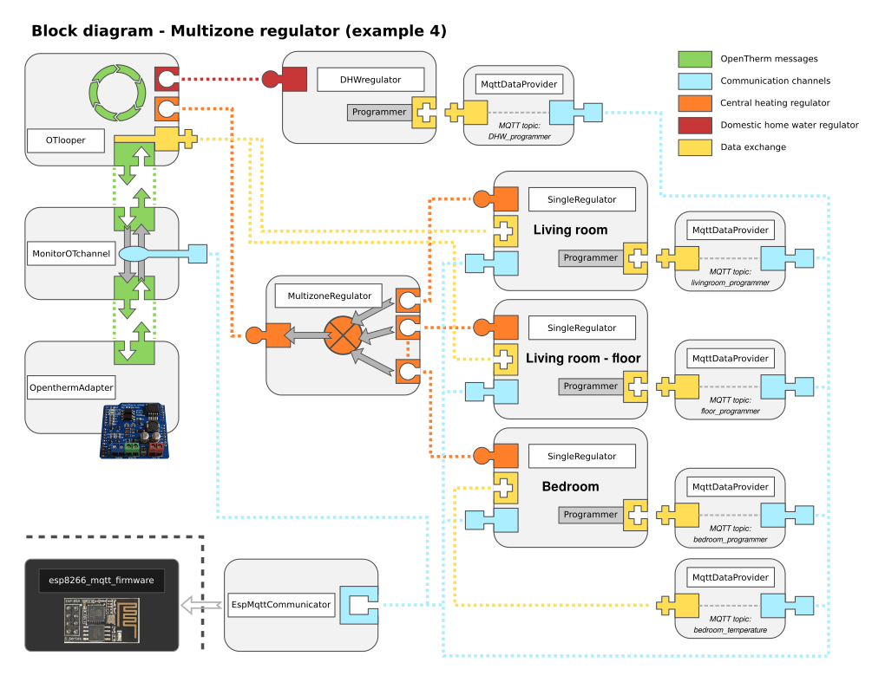

# Example 4 - Multizone thermostat
This example is an extension of example #3. In this example #4 three single thermostats are combined together and they control the room temperature in three different rooms independently, so that you can set different temperatures for each room. Control of DHW is also still active. You can also change heating programs via MQTT messages for each thermostat the same way as it is possible at example #3.

# Hardware configuration
In example #4 you nedd to add another zones. Each zone needs the heater, temperature sensor and actuator (valve). Example #4 has three zones:
* radiator in the "livingroom" with its valve, temperature is taken from thermostat
* floor heating in the "livingroom" with ist valve, temperature is taken from the same thermostat as for the radiator
* radiator in "bedroom" with its valve, temperature provided by MQTT thermometer

Here you are the schematic:

# Block diagram
Next diagram shows, how the blocks (= AMOR modules) are connected together in this example:

# How to make it work

## Prepare each zone
In order to control each zone independently you need two components for each zone:
* feedback sensor - thermometer, that will inform AMOR about actual temperature in that zone. This is expected to be done by publishing the temperature in the predefined MQTT topic. You can either buy any digital, wifi enabled thermometer, or you can build your own from Arduino/ESP modules. There are plenty of instructables on the internet.
* actuator - In HVAC, you have actually two actuators - first of them is the temperature of heating water in boiler. But this is the same for all zones. Then you need an actuator - smart thermoelectric valve, or valve connected through smart plug, that can be commanded via MQTT. This will switch off the heating in the zone in case that the temperature has reached the setpoint, so that other zones do not overheat this zone.
## Prepare the ESP8266 wifi module
You can keep the ESP8266 the same as in the examples #2 and #3.
## Prepare the Arduino
* copy the contents of this example and paste it in the main project file "AMOR_arduino.ino" (replace everything there)
* check the "Config.h", keep settings from Example #3. Default values should work fine.
* compile and upload to the arduino

# How to use it
Usage is generally identic to the example #3, except that you are now controlling more zones and you can command them independently.
